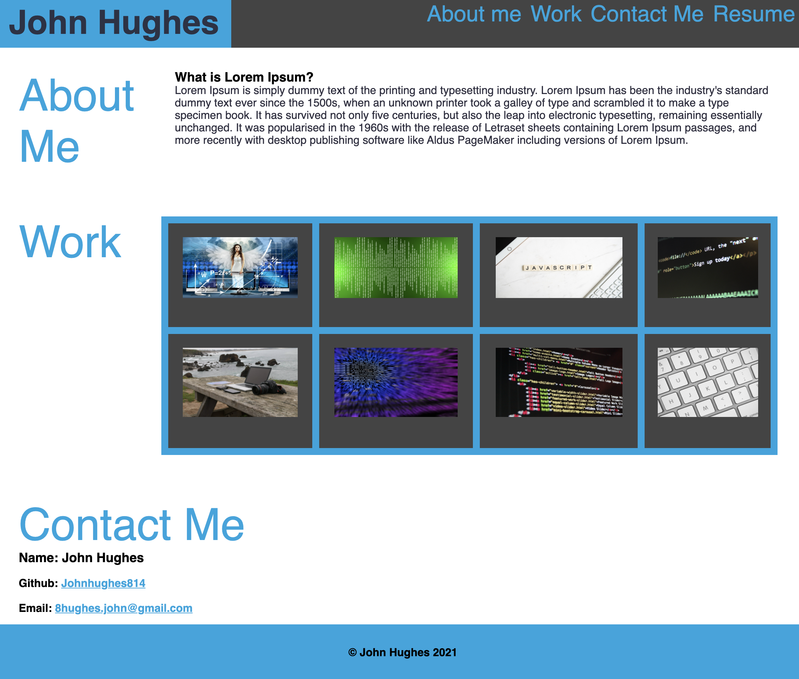
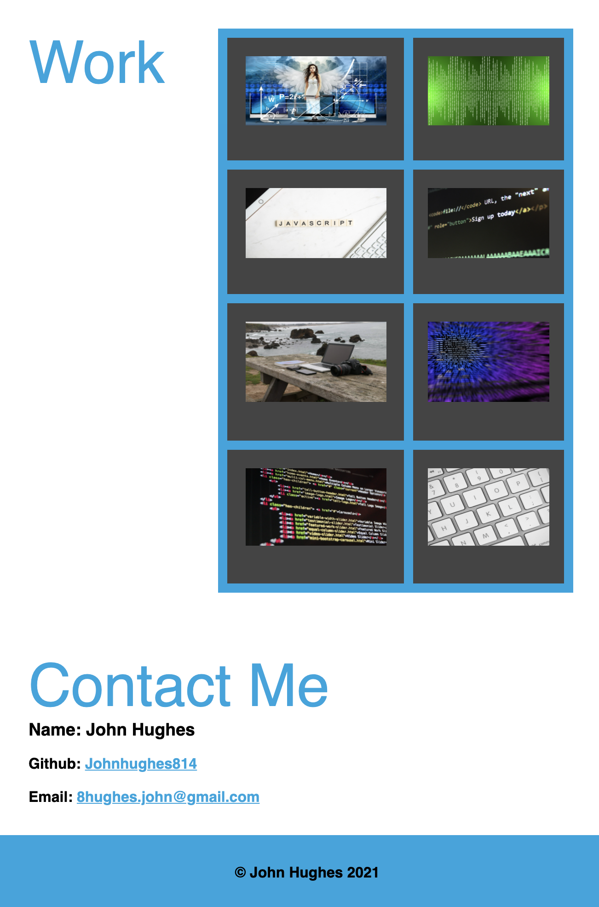

# Week2Challenge

#### For this challenge I created a basic portfolio using html and css. All style is css without the use of any frameworks or libraries. I used media queries to make the site responsive and mobile friendly.

## Desktop:

## Mobile:

